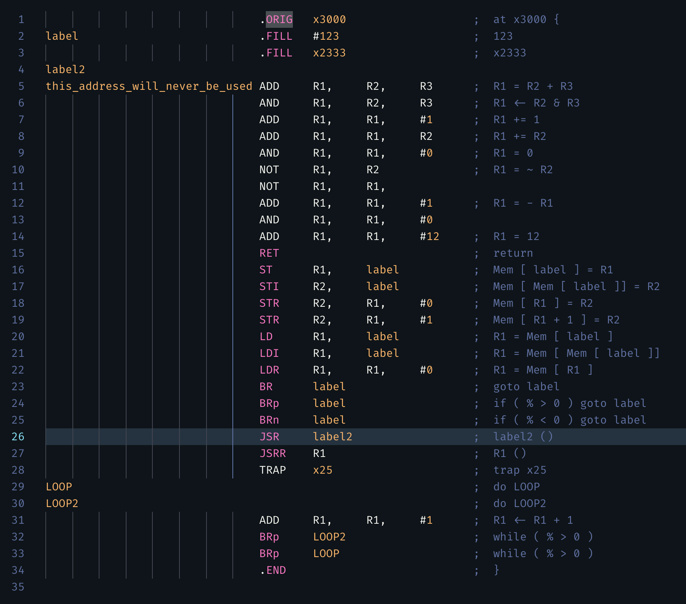

# LC-3 Assembly Like C

## Example

write lc3asmc file like this.

``` C++

at x3000 

label:
    123
    x2333
label2:
this_address_will_never_be_used: { 
    // long label support
        R1 = R2 + R3
        R1 <- R2 & R3
        R1 += 1
        R1 += R2
        R1 = 0
        R1 = ~R2
        R1 = -R1
        R1 = 12
        return
    Mem[label] = R1
    Mem[Mem[label]] = R2
    Mem[R1] = R2
    Mem[R1 + 1] = R2
    R1 = Mem[label]
    R1 = Mem[Mem[label]]
    R1 = Mem[R1]

    goto label
    if(% > 0) goto label
    if(% < 0) goto label
    label2() // call label2
    R1()
    trap x25
    do LOOP
        do LOOP2
        R1 <- R1 + 1
        while (% > 0)
    while (% > 0)
}

```

run the following code, convert this to lc3 assembly file.

``` shell
python lc3asmc.py <asmc file> -o <output file>
```

result is shown below:



Let's see an example: Lab1 written in `lc3asmc`

```C++

at x3000

using R0 as tmp
using R1 as ptr

Init_Output: {
    using R2 as endn
    using R3 as value

    ptr = Mem[Output]
    endn = Mem[nOutputEnd]
    value = -1
    do loop1
        Mem[ptr] = value
        ptr += 1
        tmp = ptr + endn
    while(% < 0)
    value -= 1
    Mem[ptr] = value
}

Load_Scores: {
    using R2 as endn
    using R3 as outptr
    ptr = Mem[Source]
    endn = Mem[nSourceEnd]
    outptr = Mem[Output]
    do loop2
        tmp = Mem[ptr]
        R4 = outptr + tmp
        Mem[R4] = tmp
        ptr += 1
        tmp = ptr + endn
    while(% < 0)
}

Sort: {
    using R2 as top
    using R3 as grade
    using R4 as count
    using R5 as n_rankmax
    using R6 as n_scoremax
    using R7 as grade_count

    ptr = Mem[Output]
    grade = CountA
    top = ptr
    count = 0
    ptr -= 1
    goto start
    do loop3
        tmp -= 1
        if(% == 0) goto endif
            tmp -= 1
            Mem[top] = tmp
            top += 1

            count += 1
            grade_count += 1

            tmp = tmp + n_scoremax
            if(% > 0) goto if2
            tmp = count + n_rankmax
            if(% <= 0) goto endif2
            if2:
                tmp = Mem[grade]
                Mem[tmp] = grade_count
                grade += 3
    start:       
                n_rankmax = Mem[grade + 1]
                n_scoremax = Mem[grade + 2]

                grade_count = 0
            endif2:
        endif:
        ptr += 1

        tmp = Mem[ptr]
        tmp += 2
    while(% != 0)
}

HALT

Data: {
    Source: x3200
    nSourceEnd: xCDC4 // -(x3200 + 60)
    Output: x4000
    nOutputEnd: xBF9B // -(x4000 + 101)

    CountA: x4100
    RankA: -20
    ScoreA: -85

    CountB: x4101
    RankB: -30
    ScoreB: -75

    CountC : x4102
    RankC: -60
    ScoreC: -60

    CountD : x4103
    RankD: -60
    ScoreD: 0
}

```


终于可以愉快地写LC-3了:smile:
